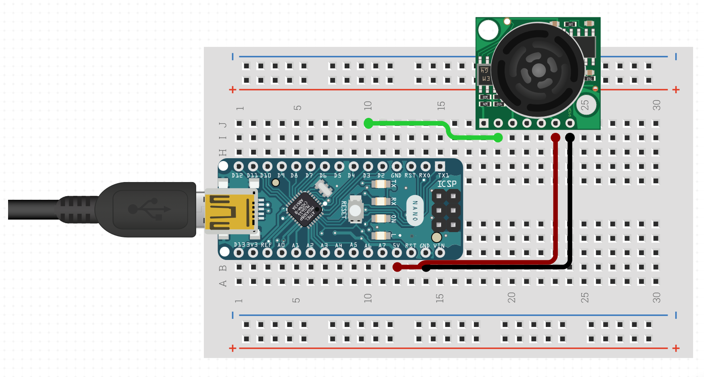

# ultrasonic-altitude-sensor

Use an ultrasonic sensor to measure altitude and display it in the cockpit of an airplane.

## Requirements

* [Arduino Nano](https://docs.arduino.cc/hardware/nano)
* [MaxBotix MB1000, MB1010, MB1020, MB1030, or MB1040 LV-MaxSonar-EZ](https://www.maxbotix.com/documents/LV-MaxSonar-EZ_Datasheet.pdf)
* 128x64 I2C OLED Display
* [PlatformIO](https://platformio.org)

## Building and Uploading

```pio run --target upload```

## Wiring

### Ultrasonic Sensor to Arduino Nano

We read the PWM (pulse width modulation) output of the ultrasonic sensor by connecting it to one of the Arduino Nano's digital pins with PWM capability (D3, D5, D6, D9, D10 or D11).



### 128x64 I2C OLED Display to Arduino Nano

We control the OLED Display using the Arduino Nano's I2C pins A4 (SDA) and A5 (SCL).


